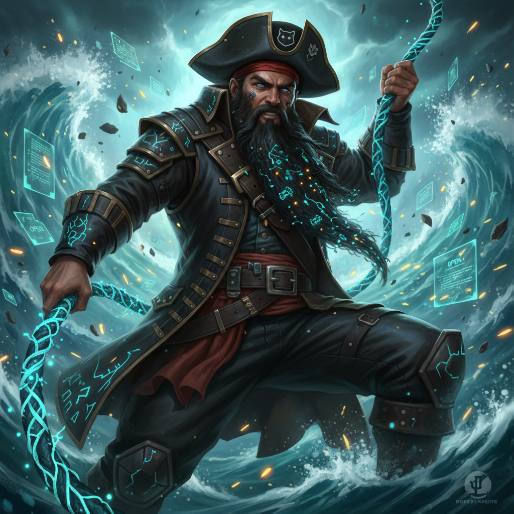

# 🏴‍☠️ Git Quest — Épisode 2 : La mutinerie des moussaillons

> "La mutinerie a dispersé mes secrets…
> - J’ai laissé un **repère** avant la révolte.
> - J’ai **caché dans la cale** un morceau hors du journal.
> - Une fausse manœuvre a **effacé** un indice… mais on peut réparer.
> - Et certaines vérités sont **annotées hors du journal**."

## Indices (docs officielles, zéro commande directe)
- Repères immobiles liés à un commit : https://git-scm.com/docs/git-tag  
- Cacher temporairement hors de l’histoire visible : https://git-scm.com/docs/git-stash  
- Réparer une mauvaise manœuvre sans réécrire l’histoire : https://git-scm.com/docs/git-revert  
- **Annotations hors du journal (notes)** : https://git-scm.com/docs/git-notes  

## Mission
1) Trouve le **repère** du capitaine et lis ce qu’il montre.  
2) Fouille la **cale** pour récupérer ce qui a été mis de côté.  
3) **Répare** l’erreur qui a fait disparaître un indice.  
4) Cherche les **annotations hors du journal** et lis ce qui est attaché au bon commit.  

Assemble les 4 fragments et viens donner la planque au capitaine.

## Conseils
- Les repères portent un nom.  
- La cale n’est pas sur la route principale.  
- La réparation vise le commit qui a causé la disparition.  
- Les annotations ne voyagent pas automatiquement avec l’histoire : il faut **les récupérer** pour les voir.
